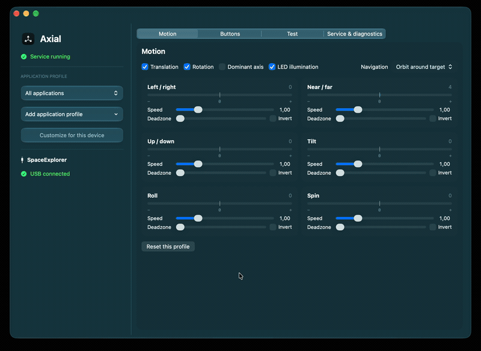

# Axial



An open-source 3Dconnexion SpaceMouse and SpaceExplorer driver. Axial provides 
six-axis navigation through native compatibility frameworks for applications 
such as Autodesk Fusion, PrusaSlicer, and FreeCAD.

## Why Axial exists

3Dconnexion stopped supporting my still-working SpaceExplorer with a current
macOS driver. Its last driver release is old and available only for Intel (x86)
macOS. Apple Silicon Macs can run that driver through Rosetta today, but Apple
has announced that macOS 28 will remove support for x86 apps and drivers. Without
a replacement, a perfectly usable SpaceExplorer would become unusable after the
upgrade. Axial keeps the device useful with a native ARM64 and Intel
implementation that does not depend on the vendor's discontinued driver.

## Install through Homebrew

Install the universal Apple Silicon/Intel release on macOS 13 or later:

```sh
brew tap consi/homebrew https://github.com/consi/homebrew
brew install --cask consi/homebrew/axial
open /Applications/Axial.app
```

Uninstall the 3Dconnexion driver first, and quit Axial and CAD applications before
installing or upgrading. The installer places the app in `/Applications` and its
compatibility frameworks in `/Library/Frameworks`; administrator access is required.
Both framework architectures are included for native and Rosetta CAD applications.
Grant Axial Accessibility permission to use keyboard shortcuts.

Release binaries are ad-hoc signed; the installer is not Developer ID signed or
notarized. macOS may require approval in **System Settings → Privacy & Security**
before Axial can run. Do not disable Gatekeeper system-wide.

```sh
brew update
brew upgrade --cask consi/homebrew/axial
```

To uninstall, disable **Start at login**, quit Axial and CAD applications, then run
`brew uninstall --cask consi/homebrew/axial`. Saved profiles and web navigation setup
are retained. Use `brew uninstall --cask --zap consi/homebrew/axial` to also remove
Axial's web certificates and loopback configuration; saved profiles are still retained.

The guarded installer and uninstaller refuse to change bundles while Axial or an
application using its frameworks is running. The error lists process names and
PIDs: quit those applications and retry. Older or incomplete bundles with missing
identifiers can be recovered when their surviving files match a known Axial
release. Foreign or unidentifiable bundles are rejected before installed files
are changed.

## Build

Development tools and commands are managed by [mise](https://mise.jdx.dev/).
CMake defines the native build and generates Xcode projects.

The app runs on macOS 13 or later. Building requires Apple development tools with
a macOS 26 or newer SDK. Full Xcode is optional for terminal builds. mise installs
the pinned CMake and Ninja versions:

```sh
mise install
mise run b
mise run t
```

The app is built at `build/native/bin/Axial.app`. This preset targets the build
machine's architecture. The `intel` preset targets x86_64; the `xcode` preset
creates a universal ARM64/x86_64 Xcode project and requires full Xcode:

```sh
mise run xcode
```

mise tasks configure and build prerequisites automatically. `b` means `build` and
`t` means `test`. Use `mise tasks` to list commands, including `bench` (performance
checks), `pkg` (installer), `stage` and `clean`.
See [CONTRIBUTING.md](CONTRIBUTING.md) for the command table, direct CMake
workflow, Intel and sanitizer builds, signing and packaging.

## Supported APIs

Axial exposes the compatibility APIs used by supported applications, plus local
service APIs for tools and integrations:

| API | Access | Purpose |
| --- | --- | --- |
| 3Dconnexion Client API | `/Library/Frameworks/3DconnexionClient.framework` | Compatibility with applications using the legacy 3Dconnexion client framework |
| Navlib API | `/Library/Frameworks/3DconnexionNavlib.framework` | Compatibility with applications using the FreeCAD/3Dconnexion navigation library |
| 3DconnexionJS API | HTTPS discovery at `https://127.51.68.120:8181/3dconnexion/nlproxy`; WAMP 1.0 at `wss://127.51.68.120:8181/` | Browser-based 3D navigation compatible with 3DconnexionJS |
| Event stream | Unix socket at `/tmp/axial-$UID/events` | Subscribe to device, motion and button events, including from a background monitor, or inject events in mock mode; see [the event stream API](docs/events.md) |
| Control API | Unix socket at `/tmp/axial-$UID/events.control` | Query status and configuration, update configuration, publish command catalogs, request Accessibility permission, or stop the service |

Here `$UID` means the numeric Unix user ID. In a shell, get it with `id -u` (or
use `$UID` in shells that provide that variable). The socket directory and both
socket names can be relocated together with the `AXIAL_SOCKET` environment
variable. The socket APIs are local to the logged-in user.

Web navigation is enabled by default. In **Service & diagnostics → WebSocket API
compatibility**, click **Set Up…** and approve the macOS prompts to configure
certificates and the loopback address. Axial checks setup health and offers repair
or renewal when needed. No separate OpenSSL installation is required; quitting
Axial closes the web listener.

## Install and use

1. **Uninstall the 3Dconnexion driver**. When updating Axial, quit it and close CAD
   applications that have loaded its frameworks.
2. Install the completed build:

   ```sh
   mise run install
   open /Applications/Axial.app
   ```

3. Use the menu-bar icon → **Open Settings…**. Closing settings keeps Axial and
   its service running; **Quit Axial** stops both. **Start at login** starts the
   app hidden and launches its service.
4. Allow **Axial** in macOS Accessibility settings to use keyboard shortcuts.
   The settings app provides an **Accessibility…** button. Changed ad-hoc builds
   may require renewed permission.
5. Reopen your CAD application. In Fusion select the **Latest** SpaceMouse driver.

To uninstall, disable **Start at login**, quit Axial, then run
`mise run uninstall`. Saved profiles are retained.

## Supported devices

Axial recognizes these USB device identities, including the SpaceMouse Wireless
through its Universal Receiver. Bluetooth connections are not supported. Counts
refer to physical HID controls exposed in Buttons.

| Device | USB vendor:product | Buttons |
| --- | --- | ---: |
| Spaceball 5000 USB | `046d:c621` | 12 |
| SpaceTraveler | `046d:c623` | 8 |
| SpacePilot | `046d:c625` | 21 |
| SpaceNavigator | `046d:c626` | 2 |
| SpaceExplorer | `046d:c627` | 15 |
| SpaceNavigator for Notebooks | `046d:c628` | 2 |
| SpacePilot Pro | `046d:c629` | 21 primary controls¹ |
| SpaceMouse Pro | `046d:c62b` | 15 |
| SpaceMouse Wireless (USB) | `256f:c62e` | 2 |
| SpaceMouse Pro Wireless (USB) | `256f:c631` | 15 |
| SpaceMouse Enterprise | `256f:c633` | 31 |
| SpaceMouse Compact | `256f:c635` | 2 |
| SpaceMouse Module | `256f:c636` | 2 inputs |
| SpaceMouse Pro Wireless BT (USB) | `256f:c638` | 15 |
| SpaceMouse Wireless (Universal Receiver) | `256f:c652` | 2 |

¹ SpacePilot Pro shares physical keys between primary and alternate codes; LCD
controls are not implemented. Enterprise's extended buttons have synthetic
report coverage. LED support depends on the device's HID output descriptor.

## Credits

Axial builds on the work and research of these open-source projects:

| Project | Contribution to Axial |
| --- | --- |
| [FreeSpacenav / spacenavd](https://github.com/FreeSpacenav/spacenavd) | USB device identities and protocol/button-mapping references |
| [PrusaSlicer](https://github.com/prusa3d/PrusaSlicer) | macOS client-framework integration used to define compatibility tests |
| [FreeCAD](https://github.com/FreeCAD/FreeCAD) | Public Navlib interface declarations, retained under LGPL-2.1 terms |
| [Blender](https://github.com/blender/blender) | Native SpaceMouse button maps used as hardware references |
| [PySpaceMouse](https://github.com/JakubAndrysek/PySpaceMouse) | MIT device definitions used by native button-replay tests |
| [nytamin/spacemouse](https://github.com/nytamin/spacemouse) | MIT raw-HID test cases adapted into native regression tests |
| [ANTz](https://github.com/openantz/antz) | Enterprise HID report investigation |
| [3dxdisp-pro](https://github.com/MiguelDLM/3dxdisp-pro) | SpacePilot Pro hardware and button research |
| [Khronos glTF Sample Assets](https://github.com/KhronosGroup/glTF-Sample-Assets/tree/main/Models/ToyCar) | CC0 Toy Car model by Guido Odendahl, with materials and scene by Eric Chadwick |

## Trademarks

3Dconnexion, SpaceMouse, SpaceExplorer, SpacePilot, SpaceNavigator,
SpaceTraveler, SpaceBall, and the other 3Dconnexion product names referenced in
this README are trademarks or registered trademarks of 3Dconnexion. Axial is
independent of and not endorsed by 3Dconnexion.

## License

Axial's original code is [MIT licensed](LICENSE). Third-party material retains
its own license; see the notices alongside each dependency. Axial is independent
of 3Dconnexion, Autodesk and Prusa Research. Proprietary driver binaries and
installed proprietary SDK files are not included.
